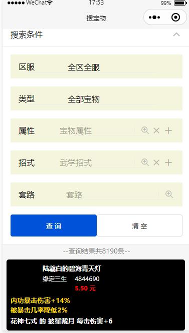
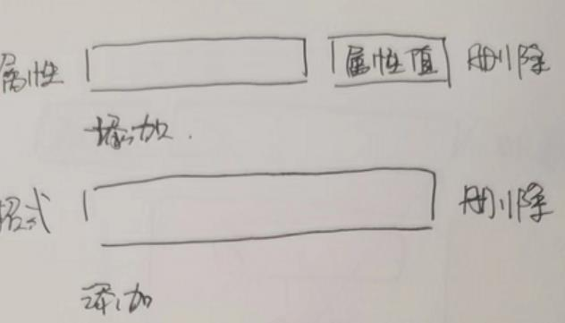
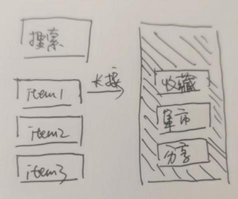

# 基于蜗牛集市的宝物搜索优化
目的：引流九阴玩家到该小程序  

背景：现有蜗牛集市的搜索功能比较糟糕，所以爬取其数据作二次搜索，先将九阴玩家引流到小程序，再通过小程序便利的搜索功能反哺官方交易平台

## 基础功能
`宝物可理解为商品`  

- 宝物搜索优化：宝物按区服（单选） + 属性词条（多选） + 套路词条（单选） + 武学词条（多选）进行搜索，并列表展示结果
- 官方交易行跳转：点击宝物的销售价，跳转官方交易页面
- 宝物上新：每批爬取的上新宝物，需要在前端添加上新标记
- 宝物收藏：收藏某个宝物，用户登录后可以收藏选中的宝物，宝物价格变化，或宝物状态变化时微信push给用户
- 搜索条件订阅：收藏现有搜索条件，可以快速应用条件，进行搜索；每批爬取，发现用户订阅的宝物上新，则push给用户（付费或积分）
- 指导价（后续）
- 成交价（后续）

## 需求1 宝物搜索优化v1

### 宝物搜索页面调整

1. 属性和招式搜索样式调整
2. 长按商品部分，弹出遮罩框，提供收藏、分享、集市按钮
   1. 点击集市，可以快速跳转到集市页面
   2. 点击分享，从下访弹出分享框，可以分享到微信

3. 展示最近一次获取数据的时间
4. 预售、在售、已售宝物的查询
5. 提供排序
   1. 按价格排序
   2. 按更新时间排序

    
    
    
    

### 后台逻辑调整

调整如下

1. 调整底表为`baowu_rec` 和 `baowu_sold_rec`

2. `baowu_rec`包含预售 + 在售宝物，同一个宝物仅存在1条记录（写表时，先查，存在则更新，不存在则插入）

3. `baowu_sold_rec` 包含已售宝物记录

   

   

# 基于蜗牛集市的角色搜索优化

`角色可理解为游戏账号`  

- 角色搜索优化：角色按区服（单选） + 价格（区间） + 修为（输入框） + 身上装备词条（多选）进行搜索，并列表展示结果
- 角色上新：每批爬取的上新角色，需要在前端添加上新标记
- 角色收藏：收藏某个角色，用户登录后可以收藏选中的角色，角色价格变化，或角色状态变化时微信push给用户
- 官方交易行跳转：点击角色的销售价，跳转官方交易页面
- 角色往期成交价(重要)：查看角色往期的成交价
- 角色往期成交记录对比(重要)：相同角色，随时间推移，装备可能升级、降级，用户可认选两条成交记录，进行对比
- 相似角色：规定相似衡量标准，1）用户查询时推荐相似角色 2）用户查询往期成交价时，防止卖家通过改名等手段，规避往期价查询
- 指导价（后续）

## 设计
