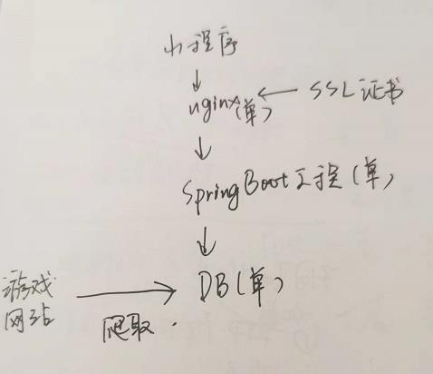

# 基于蜗牛集市的宝物搜索优化
目的：引流九阴玩家到该小程序  

背景：现有蜗牛集市的搜索功能比较糟糕，所以爬取其数据作二次搜索，先将九阴玩家引流到小程序，再通过小程序便利的搜索功能反哺官方交易平台

## 基础功能
`宝物可理解为商品`  

- 宝物搜索优化：宝物按区服（单选） + 属性词条（多选） + 套路词条（单选） + 武学词条（多选）进行搜索，并列表展示结果
- 宝物上新：每批爬取的上新宝物，需要在前端添加上新标记
- 宝物收藏：收藏某个宝物，用户登录后可以收收藏选中的宝物，宝物价格变化，或宝物状态变化时微信push给用户
- 官方交易行跳转：点击宝物的销售价，跳转官方交易页面
- 搜索条件订阅：收藏现有搜索条件，可以快速应用条件，进行搜索；每批爬取，发现用户订阅的宝物上新，则push给用户（付费或积分）
- 指导价（后续）
- 成交价（后续）

## 设计

</img>

# 基于蜗牛集市的账号搜索优化
